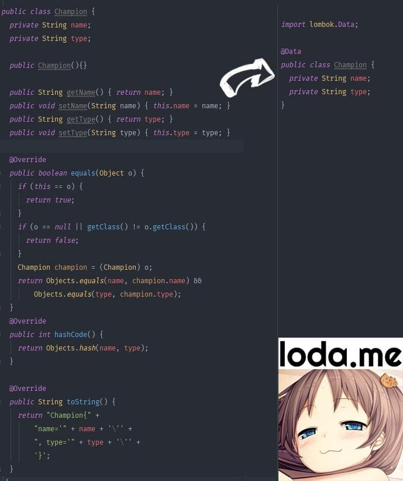

# Lombok

Lombok là một thư viện, một plugin, giúp chúng ta giảm thiểu các đoạn code thừa (boilerplate) bằng cách tự động sinh ra
các hàm Get, Set, Constructor, v.v..

### 1. Cài đặt

Để sử dụng được Lombok bạn cần có 2 điều kiện sau:

- Thư viện lombok trong project của bạn - IDE cao cấp, hỗ trợ lombok (IntelliJ IDEA, Eclipse, ..)

### 2. Sử dụng

**`@Data`**\
@Data sẽ có tác dụng generate ra Constructor rỗng hoặc có tham số theo yêu cầu (cái này sẽ nói sau), toàn bộ Get/Set,
hàm equals, hashCode, toString(), ...\


```java
import lombok.Data;

public @Data
class OK {
}

@Data
public class OK2 {
} 
```

**`Constructor`**\
Lombok hỗ trợ 3 Annotation để custom constructor:

- @NoArgsConstructor: Hàm khởi tạo rỗng, đã đề cập ở trên
- @AllArgsConstructor: Hàm khởi tạo chứa tất cả thuộc tính, ví dụ Champion(String name, String type)
- @RequiredArgsConstructor: Hàm khởi tạo theo yêu cầu. Bạn chỉ muốn hàm khởi tạo có vài thuộc tính do bạn chọn thôi, thì
  bạn thêm final trước thuộc tính trong class, nó sẽ tự sinh ra Constructor như thế.

**`@Getter/@Setter`**\
Nếu chỉ muốn generate mỗi Get/Set thôi và không muốn dùng @Data vì nó quá nhiều chức năng, thì có thể xài 2 câu thần chú
@Getter và @Setter

```java
import lombok.Getter;
import lombok.Setter;

@Getter
@Setter
class OK {
    private String id;
}
```

**Hoặc** có thể áp dụng cho field của class như sau:

```java
class OK {
    @Getter
    @Setter
    private String id;
    // Tạo ra protected setType(String) thay vì public
    @Setter(AccessLevel.PROTECTED)
    private String type;
}
```

**`@ToString`**\
Tạo ra hàm toString() từ thuộc tính class. Sử dụng `includeFieldNames` để thêm tên của field vào output của method
toString().

```java

@ToString
public class Champion {
    private String name;
    // Bỏ qua thuộc tính type khi tạo method toString()
    @ToString.Exclude
    private String type;
}
```

```java

@ToString(callSuper = true, exclude = "someExcludedField")
public class OK {
}
```

**`@EqualsAndHashCode`**\
Tạo ra hàm equals và hashCode

```java
@EqualsAndHashCode(callSuper = true, exclude = {"address", "city", "state", "zip"})
public class Person {
    @NonNull
    private String name;
    @NonNull
    private Gender gender;
    private String ssn;
    private String address;
    private String city;
    private String state;
    private String zip;
}
```

**`@Builder`**\
Hỗ trợ tạo Builder pattern cho class hiện tại

```java

@Builder
public class Champion {
    private String name;
    private String type;
}
```

**`@NotNull`**\
The `@NonNull` annotation is used to indicate the need for a fast-fail null check on the corresponding member. When
placed on a field for which Lombok is generating a setter method, a null check will be generated that will result in a
NullPointerException, should a null value be provided.

```java
@Getter @Setter @NonNull
private List<Person> members;
```

Khi sử dụng sẽ như sau

```
Champion loda = Champion.builder()
        .name("loda")
        .type("Support")
        .build();
```

**`@Cleanup`**\
**`@Synchronized`**\
**`@SneakyThrows`**\

### 3. Tham khảo

Link:

- [Lombok](https://projectlombok.org/)
- [Annotations](https://objectcomputing.com/resources/publications/sett/january-2010-reducing-boilerplate-code-with-project-lombok)
-

** ok **
.
